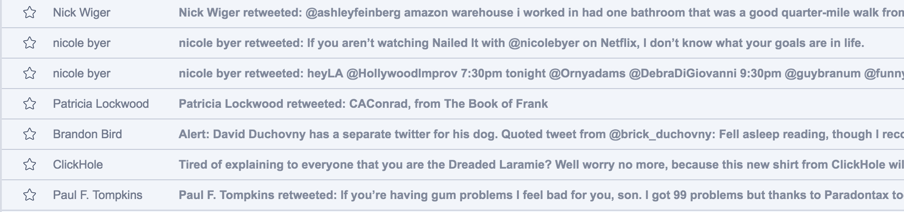

I’m sure there’s a german word for that moment when you close Twitter then think to yourself “I wonder what is going on over at twitter-dot-com” and immediately open it back up. It was all too often that I found myself either doing that or bouncing between that and some other distraction, not using my time the way that I’d like.

Infinite scroll was bad enough, but the introduction of the dreaded “algorithmic timeline” has only made it worse — now I’m even re-reading a ton of stuff I’ve already seen. I decided it was time to try something.

I check Twitter/Reddit/etc. for one of two reasons: I’m bored or I’m worried I’m going to miss something great. The latter is way less likely, but it has served as a sort of justification, “If I keep checking, there’s no way I’ll miss anything!”

So I came up with a solution that would solve both of these problems, why not read Twitter via an RSS reader? And while I’m at it, why not just make an RSS reader pretty much the only way to get content in front of me? Then at least I’m in control of when I see things, and I can be sure I’ll actually see things by prioritizing the tweets I care about above the noise.

**Step 1)** Get a list of everyone I follow. I did this via a quick script¹ that exported the data to a CSV.

**Step 2)** Go through this CSV and add a column for which group best fits the person. Based on my follows I went with a few broad categories “comedy”, “news”, etc. and then a special category for accounts I really don’t want to miss tweets from. I also marked about 50 accounts as “maybe-unfollow.” (That’s a great part about this, following is no longer going to be a binary choice, I can test if I’d miss any of that content before saying goodbye to it.)

**Step 3)** Import these categories as groups, I also did this via a quick script. At this point I had 8 groups including my “maybe-unfollows.”

**Step 4)** Using [Inoreader](https://www.inoreader.com) I then [subscribed](https://blog.inoreader.com/2014/10/rowing-down-twitter-stream-with.html) to these 8 lists. So far I can say that Inoreader seems to do a great job with this, and the Plus plan costs just a few dollars a month and lets you create up to 30 Twitter feeds. Originally I had planned to cook something up myself to turn these lists into RSS feeds, but I appreciate not having to maintain this myself. Once they’re imported a twitter feed looks something like this:

(If you aren’t sure you want to do this but are curious — there is a free 30 day trial of Inoreader Pro, if there are other decent RSS readers that can do Twitter integration let me know and I’ll add them here.)

**Step 5)** I wanted to break the habit of visiting Twitter without blocking it outright² so I could still click through on interesting tweets. I realized that if I unfollowed almost everyone it’d make TweetDeck look very boring, which is the goal here. (I put a note up about why I was doing it, I don’t know what the etiquette is on these things but I didn’t want any of my acquaintances think that a recent tweet of theirs had somehow offended my delicate sensibilities.)

And that’s it. Now when I want to read something online, I visit Inoreader. If I’m out of things I want to read I know not to come back right away and there’s no other site to bounce to³ while I wait for 3 new tweets to roll in. The fact that it takes a few minutes for it to update with tweets prevents me from just sitting there waiting for something to happen. I also get some nice metrics on what I read/don’t read that I’ll use to further prune my reading habits.

— —

¹ [https://gist.github.com/jamesturk/60d54c39717121f8db4dc1191ce95f1d](https://gist.github.com/jamesturk/60d54c39717121f8db4dc1191ce95f1d)

² For locking down where you spend your idle time I recommend a site-blocking extension like [BlockSite for Chrome](https://chrome.google.com/webstore/detail/block-site-website-blocke/eiimnmioipafcokbfikbljfdeojpcgbh) or [Firefox](https://addons.mozilla.org/en-US/firefox/addon/blocksite/).

³ I also used [Reddit’s built-in RSS support](https://www.reddit.com/wiki/rss) to follow a few RSS feeds of various subreddits (only for interesting niche reddits, no point in doing this and adding all the busy/toxic ones).
